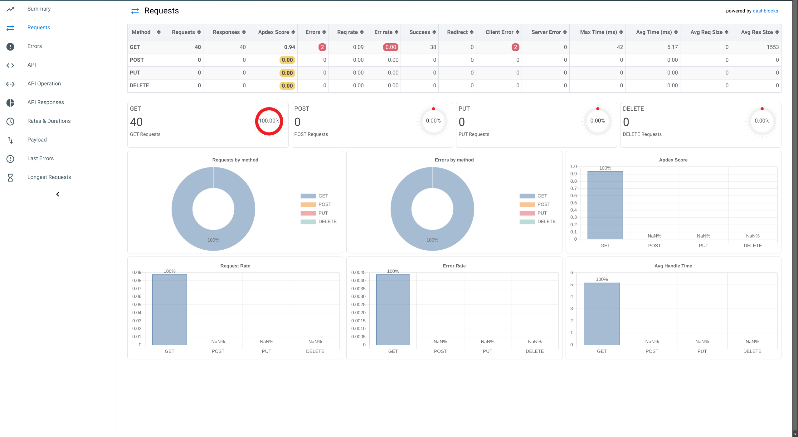

# Ultimate Nest.js Boilerplate ⚡

Advanced Nest.js boilerplate for scalable startups.

## Features📦

- [x] NestJS with Fastify
- [x] PostgreSQL & TypeORM
- [x] Offset and Cursor based Pagination
- [x] REST & GraphQL API
- [x] Websockets using Socket.io via Redis Adapter(For future scalability with clusters)
- [x] Cookie based authentication for all REST, GraphQL & WebSockets.
- [x] Swagger Documentation and API versioning for REST API
- [x] Automatic API generation on the frontend using OpenAPI Codegen [Learn More](#1-automatic-api-generation-on-the-frontend-)
- [x] BullMQ for Queues. Bull board UI to inspect your jobs
- [x] Worker server for processing background tasks like queues
- [x] Caching using Redis
- [x] Pino for Logging
- [x] Rate Limiter using Redis
- [x] Graceful Shutdown
- [x] Server & Database monitoring with Prometheus & Grafana [Learn More](#4-server--database-monitoring-)
- [x] API Monitoring with Swagger Stats [Learn More](#5-api-monitoring-)
- [x] File Uploads using AWS S3
- [x] Sentry
- [x] Testing with Jest
- [x] Internationalization using i18n
- [x] pnpm
- [x] Docker: Dev & Prod ready from single script. [Learn More](#6-docker-)
- [x] Github Actions
- [x] Commitlint & Husky
- [x] SWC instead of Webpack
- [x] Dependency Graph Visualizer [Learn More](#2-dependency-graph-)
- [x] Database Entity Relationship Diagram Generator [Learn More](#3-database-entity-relationship-diagram️)

### 1. Automatic API generation on the Frontend 🚀

You can automatically generate and use all of your backend API in frontend in just one command, thanks to Swagger and OpenAPI spec. Running `pnpm codegen` on the frontend (example [repo](https://github.com/niraj-khatiwada/openapi-codegen)) will automatically generate all API's bootstrapped with [Tanstack Query](https://tanstack.com/query/latest) ready to be used with just one import. See complete example [here](https://github.com/niraj-khatiwada/openapi-codegen)


### 2. Dependency Graph 📈

Visualize all of your project modules and their dependencies. Also, detect circular dependencies.

NOTE: Make sure [Graphviz](https://www.graphviz.org/) is installed first.

- All dependencies:

```
pnpm graph:app
```

- Only circular dependencies:

```
pnpm graph:circular
```

<figure>

</figure>

### 3. Database Entity Relationship Diagram🛢️

Visualize your database entities and their relationships.

```
pnpm erd:generate
```

<figure>

</figure>

### 4. Server & Database Monitoring 🚨

Prometheus & Grafana are available with Docker setup only. You might only need to monitor your server or database when the user base grows or when you want to debug some specific issues. That's why this step is completely optional. If you want to monitor your server or database, just enable `monitoring` profile in your `.env` i.e. `COMPOSE_PROFILES=monitoring`.

Server Monitoring Dashboard:


Database Monitoring Dashboard:


### 5. API Monitoring 📊

Monitor all your API endpoints, their response time, error rates & payload, requests per second, etc. and many more using your Swagger API.

Visit `<host>/swagger-stats` and enter username and password of grafana set in `.env` to view the dashboard.



### 6. Docker 🐬

##### For local development:

- Start container:

```
pnpm docker:dev:up
```

- Stop container:

```
pnpm docker:dev:down
```

##### For prod build:

- Start container:

```
pnpm docker:prod:up
```

- Stop container:

```
pnpm docker:prod:down
```

##### Deployment:

```
sh ./bin/deploy.sh
```

or run workflow `.github/workflows/main.yml` via GitHub Actions.

This boilerplate is extended from [nestjs-boilerplate](https://github.com/vndevteam/nestjs-boilerplate?tab=readme-ov-file)
